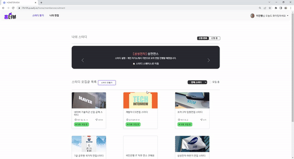
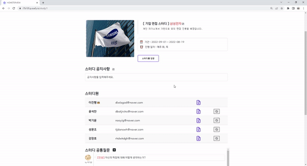
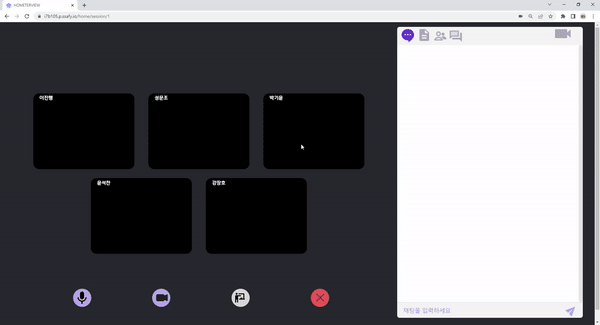
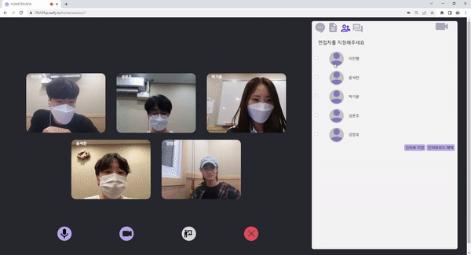
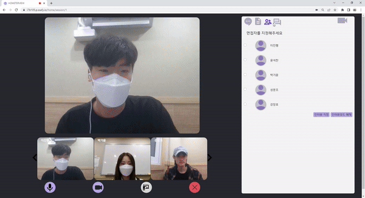
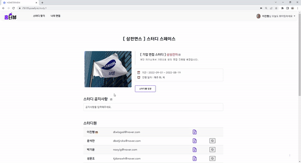
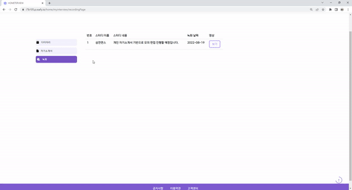

# 🏠홈터뷰 ( Home + Interview )
**🏆SSAFY 2학기 공통 프로젝트 우수상 수상**
### ✏️ 1. 프로젝트 소개

- 배경
  - 비대면 면접 스터디에 대한 수요 증가
  - 일원화되어 있지 않은 비대면 면접스터디

- 목적
  - 비대면 스터디를 원하는 유저들에 대한 니즈를 파악하여 기존에 있던 불편함을 해소

- overview
  - 스터디 모집과 화상회의 서비스를 동시에 제공하여 사용자의 번거로움을 해소
  - TTS(Text to Speech) 모드를 활용하여 스터디원 모두가 면접자가 되어 모의면접 진행
  - AI 자세 교정 기능을 통해 면접 준비 과정에서 개인이 신경 쓰기 힘든 자세를 인식하여 교정
  - 녹화기능, 회고 등록, 캘린더 활용 등을 통한 자가분석 가능
 
 <br>

### 🛠 2. 개발 환경 및 기술 스택

**Frontend**

- Vue3 version

- Vuex 3.4.0

- CSS3

- JavaScript(ES6)

- HTML5

**Backend**

- SpringBoot 2.7.1

- Gradle 7.4.1

- Spring Security

- Spring data JPA

- Querydsl **DB** MySQL : 8.0.29

- Redis 

**WebRTC**
- Openvidu

**ETC**
- Google Cloud Text-to-Speech

- Teachable machine

<br>

### 🧭 3. 주요 기능
|제목|설명|
|-----|----------|
|유저 관리|- 로그인<br>- 회원가입 (이메일 인증, 아이디/비밀번호 중복 및 유효성 검사)<br>- 회원 탈퇴<br>- 아이디 찾기 및 비밀번호 변경<br>- 프로필 사진|
|스터디 모집글 관리|- 모집글 작성, 조회, 수정, 삭제<br>- 모집글 필터링 (모집 완료/모집 중)<br>- 모집글 검색 (기업명)<br>- 스터디 가입 신청|
|자기소개서 관리|- 자기소개서 작성, 조회, 수정, 삭제<br>- 개인 예상 질문 작성, 조회, 수정, 삭제|
|스터디 관리|- 스터디 생성, 정보 조회, 수정, 삭제<br>- 스터디원 공통질문 작성, 조회, 수정, 삭제<br>- 스터디 썸네일 이미지 설정<br>- 스터디원 추방 및 탈퇴|
|화상 회의|- 채팅<br>- 마이크 on/off<br>- AI 자세 교정 (스터디원이 중앙에 탐지되지 않는 경우 빨강 테두리 표시)<br>- TTS 모드 (면접관 이미지 pop up 및 공통 예상 질문 리스트 출력, 공통 질문 클릭 시 음성 출력)<br>- 면접자 지정 모드 (등록된 면접자 화면 출력, 면접자 자기소개서 조회 및 예상 질문 리스트 출력)<br>- 녹화 기능|
|면접 관리|- D-day 관리<br>- 캘린더, 회고록 연동<br>- 녹화본 조회|
|공지사항|- 공지사항 작성, 조회, 수정, 삭제 (관리자 권한)|

<details>
<summary>결과물 PREVIEW</summary>
<div markdown="1">       

- 멤버 모집글 페이지



- 스터디 스페이스



- Session - 채팅




- Session - 면접관 지정



- Session - tts mode



- 회고



- 녹화



</div>
</details>

<br>

### 📜 4. 프로젝트 빌드 및 배포

#### 빌드 설정

```markdown
**소스코드 클론**
git clone  <repo URL>

**디렉토리 이동**
cd backend

**gradle 프로젝트 빌드**
./gradlew 

**생성된 jar 파일 확인**
cd build/libs ssafy-web-project-1.0-SNAPSHOT.jar
```

 #### AWS EC2 서버 설정

모든 설치 전 실행

```markdown
패키지 업데이트 
apt-get update
```

#### java 설치

```markdown
**JRE 설치**
sudo apt-get install openjdk-8-jre

**JDK 설치**
sudo apt-get install openjdk-8-jdk

**자바 설치 버전 확인**
java -version
javac -version

**자바 환경변수 설정**

1. vi 에디터 열기
sudo vi /etc/profile

2. 맨 아래 추가 하기
export JAVA_HOME=/user/lib/jvm/java-8-openjdk-amd64
export PATH=$JAVA_HOME/bin/:$PATH
export CLASS_PATH=$JAVA_HOME/lib:$CLASS_PATH

3. 변경 내용 즉시 적용하기
source /etc/profile

4. 재부팅하기
sudo reboot now
```

#### 방화벽 설정

```markdown
**현재 방화벽 설정 확인**
sudo ufw status

if ufw == inactive 

**방화벽 설정**
sudo ufw allow 22
sudo ufw enable
```

#### mysql 설치

```markdown
**mysql 설치**
sudo apt install mysql-server

## mysql 외부 접속 설정

**디렉토리 이동**
cd /etc/mysql/mysql.conf.d

**mysqld.cnf 파일 수정**
sudo vi mysqld.cnf

**설정 변경**
bind-address 127.0.0.1 -> 0.0.0.0

**mysql 접속**
sudo mysql 

**외부 접속 계정 생성 & 권한 부여**
create user '계정이름'@'%' identified by '패스워드';
grant all privileges on *.* to '계정이름'@'%' with grant option;

**mysql 접속 포트 추가**
sudo ufw allow 3306
```

#### redis 설치

```markdown
**redis 설치**
sudo apt-get install redis-server

**redis 설치 확인**
redis-server --version

**redis 설정**
sudo vi /etc/redis/redis.conf

**변경** 
bind 127.0.0.1 => bind 0.0.0.0

**redis 실행**
sudo systemctl start redis-server

**redis 접속 포트 추가**
sudo ufw allow 6379
```

#### nginx 설치

```markdown
**nginx 접속 포트 추가**
sudo ufw allow 80 
sudo ufw allow 443

**Nginx 설치**
sudo apt-get install nginx

**Nginx 시작**
sudo service nginx start

**설정파일 생성**
cd /etc/nginx/sites-available
sudo vi b105.conf

**sites-enabled에 심볼릭 링크 만들기**
udo ln -s /etc/nginx/sites-available/b105.conf /etc/nginx/sites-enabled

**심볼릭 링크 추가 확인**
cd /etc/nginx/sites-enabled
ls -l

**기존 설정파일 삭제**
sudo rm default

**재구동 및 확인**
sudo service nginx restart

**SSL 인증서 발급**
sudo service nginx restart
```

#### openvidu 설정

```markdown
**서버 포트 구성**
sudo ufw allow ssh
sudo ufw allow 80/tcp
sudo ufw allow 443/tcp
sudo ufw allow 3478/tcp
sudo ufw allow 3478/udp
sudo ufw allow 40000:57000/tcp
sudo ufw allow 40000:57000/udp
sudo ufw allow 57001:65535/tcp
sudo ufw allow 57001:65535/udp

**디렉토리 이동**
cd /opt

**OpenVidu 파일 다운로드**
curl <https://s3-eu-west-1.amazonaws.com/aws.openvidu.io/install_openvidu_latest.sh> | bash

cd /opt/openvidu

**설정파일 수정**
vi .env

# 에디터에서 아래의 값을 찾아서 변경
DOMAIN_OR_PUBLIC_IP=<서버 주소 또는 도메인>
OPENVIDU_SECRET=<서버 비밀번호>
CERTIFICATE_TYPE=letsencrypt # letsencrypt를 사용하여 SSL 인증서 발급
LETSENCRYPT_EMAIL=<이메일> # letsencrypt에서 사용할 이메일
HTTP_PORT=80
HTTPS_PORT=443
# HTTP_PORT와 HTTPS_PORT는 letsencrypt 방식의 키를 발급 받기 전까진 기본 포트인 80, 443을 사용해야 합니다!
# 키를 발급받고 난 후부터는 포트 변경 

키 발급 후 **포트 변경**
HTTP_PORT=8081
HTTPS_PORT=8443

**OpenVidu 서버 실행**
./openvidu start

**동작 확인**
sudo docker ps
```

#### tts 설정

```markdown
**서버 포트 구성**
sudo ufw allow 9002/tcp

디렉토리 생성
cd ..
mkdir ttsserver

**package.json 생성**
npm init

express 설치
npm install express
+ google text-to-speech, cors, 등 설치

** tts 사용을 위한 설정 파일 작성 **
구글에서 서비스 계정생성 -> api키 json파일 받아서 추가

**무중단 배포를 위해 pm2 설치**
npm install -g pm2
```

#### 배포

```markdown
**디렉토리 이동** 
cd /home/ubuntu

java -jar ssafy-web-project-1.0-SNAPSHOT.jar

**디렉토리 이동**
cd /home/ttsserver

pm2 start server.js
```
